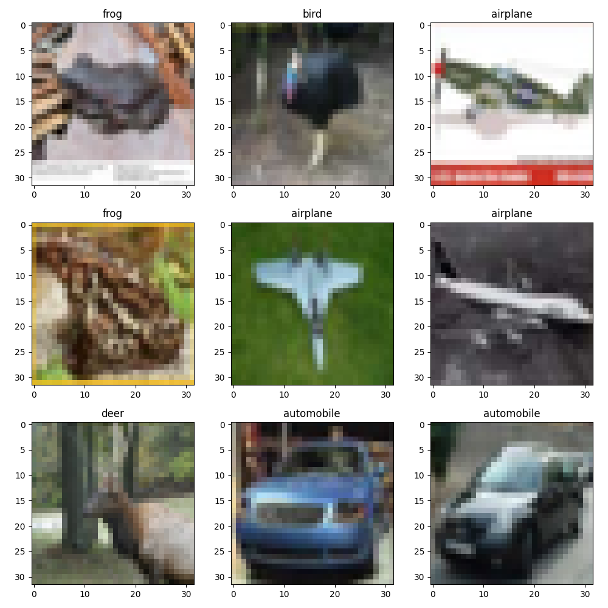
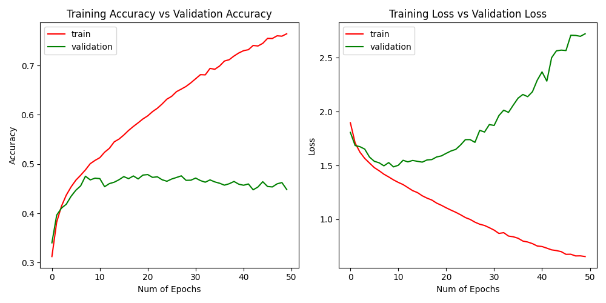
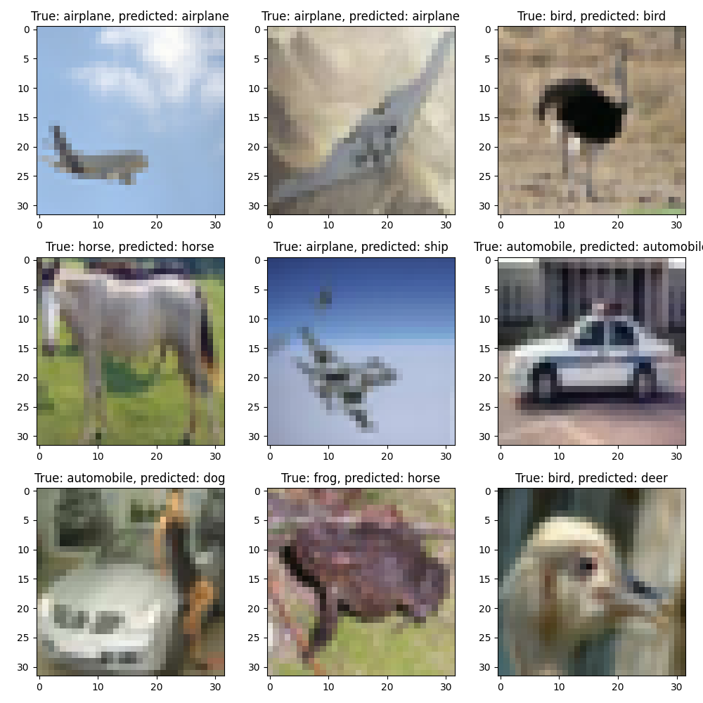

# Tutorial Deep Learning con Tensorflow/Keras

## Instalación

1. Instalar Anaconda:
   
    https://www.anaconda.com/
   
2. Importar el entorno (archivo ```envoronment.yml```)
        
        conda env create -f envoronment.yml

## Red totalmente conectada

### Entrenamiento del modelo

En este ejemplo utilizaremos el dataset ```CIFAR10``` para entrenar un clasificador

- Ejemplo del tipo de imágenes del dataset:



Ejecuta el script ```cifar10_tf_fcn.py``` para entrenar el modelo

Este es un ejemplo de entrenamiento, en el que se ve que hay sobreentrenamiento (overfitting) a partir de la `epoch` 8~10 aproximadamente:



Y esta imagen muestra un ejemplo visual de los resultados con el modelo anterior:



En este caso, la precisión (accuracy) del modelo es:

      test accuracy: 0.4546

### Ajuste de hiperparámetros

Para mejorar el resultado se pueden modificar los siguientes parámetros:

- Número de capas
- Número de unidades en cada capa
- Optimizador: [opciones](https://keras.io/api/optimizers/)
- Función de coste: [opciones](https://keras.io/api/losses/)
- `learning_rate`: [explicación](https://towardsdatascience.com/understanding-learning-rates-and-how-it-improves-performance-in-deep-learning-d0d4059c1c10)
- `n_epochs`: [explicación](https://towardsdatascience.com/epoch-vs-iterations-vs-batch-size-4dfb9c7ce9c9)
- `batch_size`: [explicación](https://machinelearningmastery.com/difference-between-a-batch-and-an-epoch/#:~:text=The%20number%20of%20epochs%20is%20traditionally%20large%2C%20often%20hundreds%20or,500%2C%201000%2C%20and%20larger.)
- `validation_split`: [explicación](https://towardsdatascience.com/train-validation-and-test-sets-72cb40cba9e7)
- `activation`: [opciones](https://keras.io/api/layers/activations/)


### Resultados

Podemos ir añadiendo los resultados con distintas configuraciones en el hilo de [discussions](https://github.com/esansano/tutorial-dl/discussions)