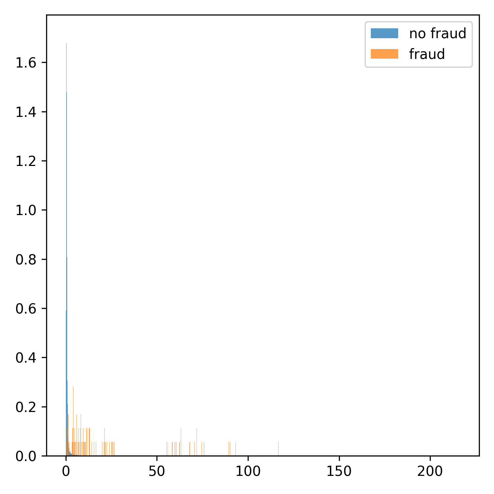

# Tutorial Deep Learning con Tensorflow/Keras

## Instalación

### Con Anaconda

1. Instalar Anaconda:
   
    https://www.anaconda.com/
   
2. Importar el entorno (archivo ```envoronment.yml```)
        
        conda env create -f envoronment.yml

### Sin Anaconda

- [Instrucciones de instalación](https://www.tensorflow.org/install/pip?hl=es_419)
- [Instrucciones para usar la GPU](https://www.tensorflow.org/install/gpu?hl=es_419)

## Red totalmente conectada

### Entrenamiento del modelo

En este ejemplo utilizaremos el dataset ```CIFAR10``` para entrenar un clasificador

- Ejemplo del tipo de imágenes del dataset:


Ejecuta el script ```cifar10_tf_fcn.py``` para entrenar el modelo

Este es un ejemplo de entrenamiento, en el que se ve que hay sobreentrenamiento (overfitting) a partir de la `epoch` 80 aproximadamente:


Y esta imagen muestra un ejemplo visual de los resultados con el modelo anterior:


En este caso, la precisión (accuracy) del modelo es:

      test accuracy: 0.5267

### Ajuste de hiperparámetros

Para mejorar el resultado se pueden modificar los siguientes parámetros:

- Número de capas
- Número de unidades en cada capa
- Optimizador: [opciones](https://keras.io/api/optimizers/)
- Función de coste: [opciones](https://keras.io/api/losses/)
- `learning_rate`: [explicación](https://towardsdatascience.com/understanding-learning-rates-and-how-it-improves-performance-in-deep-learning-d0d4059c1c10)
- `n_epochs`: [explicación](https://towardsdatascience.com/epoch-vs-iterations-vs-batch-size-4dfb9c7ce9c9)
- `batch_size`: [explicación](https://machinelearningmastery.com/difference-between-a-batch-and-an-epoch/#:~:text=The%20number%20of%20epochs%20is%20traditionally%20large%2C%20often%20hundreds%20or,500%2C%201000%2C%20and%20larger.)
- `validation_split`: [explicación](https://towardsdatascience.com/train-validation-and-test-sets-72cb40cba9e7)
- `activation`: [opciones](https://keras.io/api/layers/activations/)


### Resultados

Podemos ir añadiendo los resultados con distintas configuraciones en el hilo de [discussions](https://github.com/esansano/tutorial-dl/discussions)

## Red convolucional

Ejecuta el script ```cifar10_tf_cnn.py``` para entrenar el modelo

### Resultados sin *Data Augmentation* (`data_augmentation = False`)

Este es un ejemplo de entrenamiento, en el que se ve que hay sobreentrenamiento (overfitting) a partir de la `epoch` 15~20 aproximadamente:


En este caso, la precisión (accuracy) del modelo es:

      test accuracy: 0.7184

### Resultados con *Data Augmentation* (`data_augmentation = True`)

Este es un ejemplo de entrenamiento en el que no hay *overfitting*:


En este caso, la precisión (accuracy) del modelo es:

      test accuracy: 0.7931

### Ajuste de hiperparámetros

Para mejorar el resultado se pueden modificar los siguientes parámetros:

- Activar/Desactivar `data_augmentation` y los parámetros que modifican las imágenes de entrenamiento
- Número de capas
- Número de unidades en cada capa
- Parámetros de las capas convolucionales (`kernel_size`, `strides`, `filters`): [explicación](https://towardsdatascience.com/simple-introduction-to-convolutional-neural-networks-cdf8d3077bac)
- Capas `BatchNormalization`: [explicación](https://machinelearningmastery.com/batch-normalization-for-training-of-deep-neural-networks/)
- Dropout: [explicación](https://towardsdatascience.com/an-intuitive-explanation-to-dropout-749c7fb5395c)
- Optimizador: [opciones](https://keras.io/api/optimizers/)
- Función de coste: [opciones](https://keras.io/api/losses/)
- `learning_rate`: [explicación](https://towardsdatascience.com/understanding-learning-rates-and-how-it-improves-performance-in-deep-learning-d0d4059c1c10)
- `n_epochs`: [explicación](https://towardsdatascience.com/epoch-vs-iterations-vs-batch-size-4dfb9c7ce9c9)
- `batch_size`: [explicación](https://machinelearningmastery.com/difference-between-a-batch-and-an-epoch/#:~:text=The%20number%20of%20epochs%20is%20traditionally%20large%2C%20often%20hundreds%20or,500%2C%201000%2C%20and%20larger.)
- `validation_split`: [explicación](https://towardsdatascience.com/train-validation-and-test-sets-72cb40cba9e7)
- `activation`: [opciones](https://keras.io/api/layers/activations/)

## Autoencoders

### Ejemplo 1: Detección de fraude

Ejecuta el script ```fraud_detection_tf_ae.py``` para entrenar el modelo

#### Aprendizaje no supervisado

Se entrena el modelo únicamente con los ejemplos de transacciones normales


Una vez entrenado, utilizamos el conjunto de validación para buscar un umbral sobre el error de reconstrucción que nos permita separar las transacciones fraudulentas de las normales.



Zoom:


Se ve claramente que tenemos dos distribuciones distintas, aunque se solapan en algún intervalo.

Representamos algunas métricas (precision, recall y f1):


Como ejemplo, si elegimos un umbral para el error de reconstrucción de 5, obtendríamos esta separación de las clases:


y esta matriz de confución:


